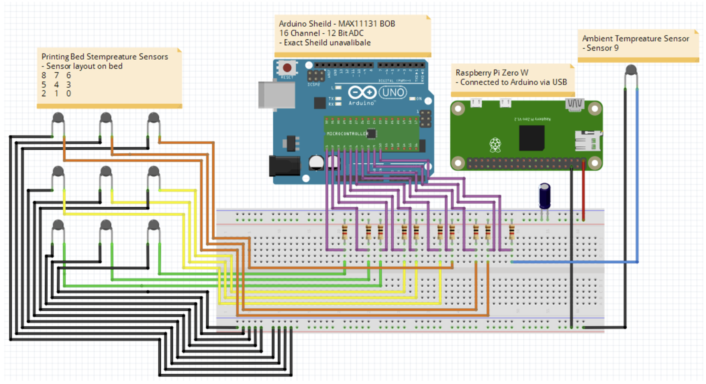
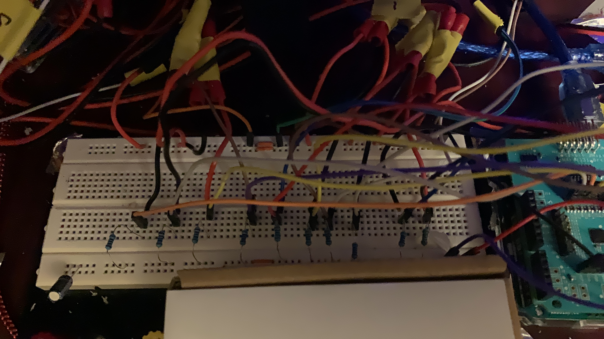
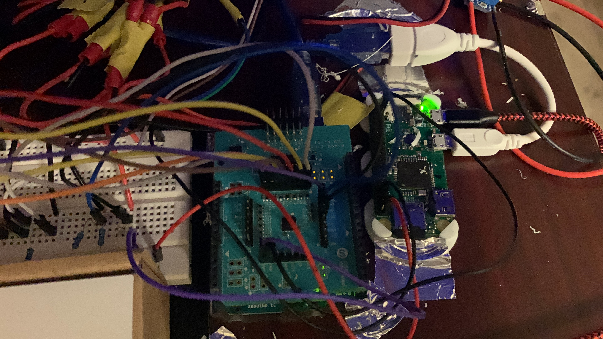
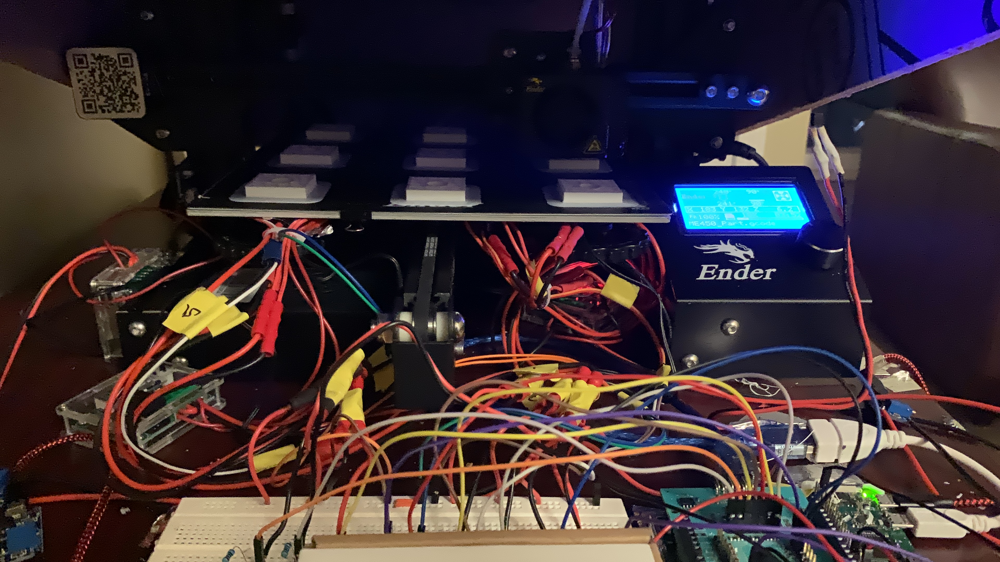
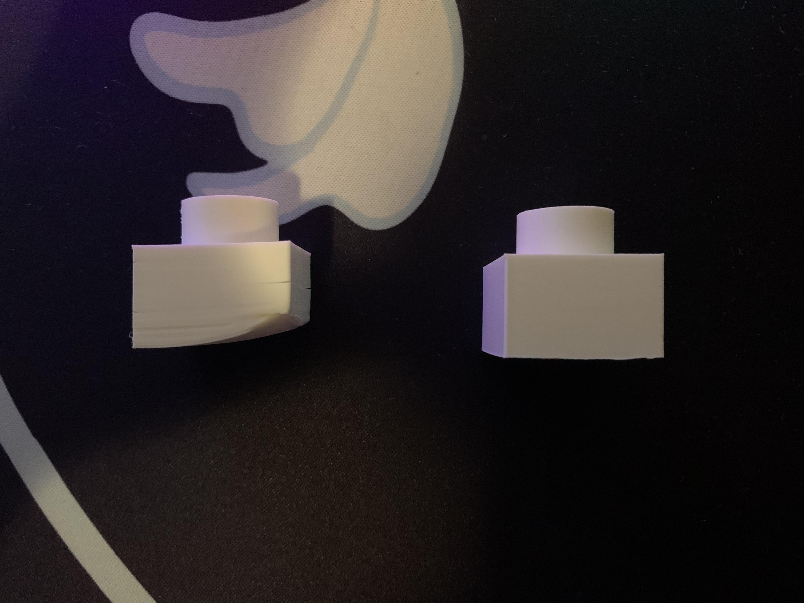
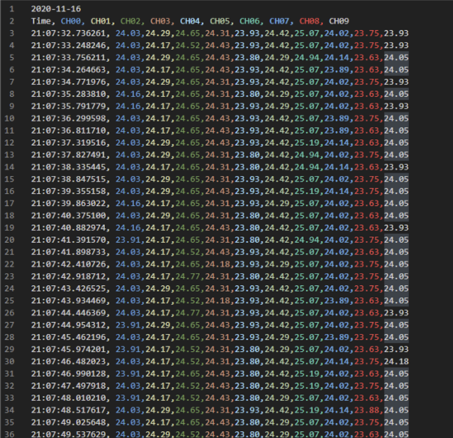
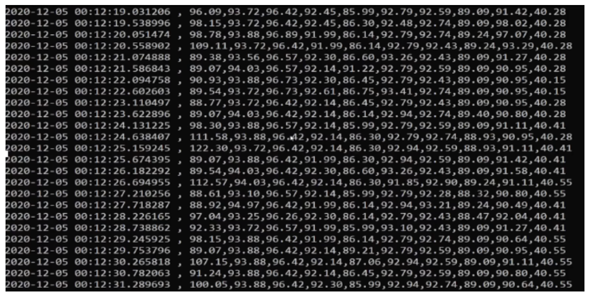
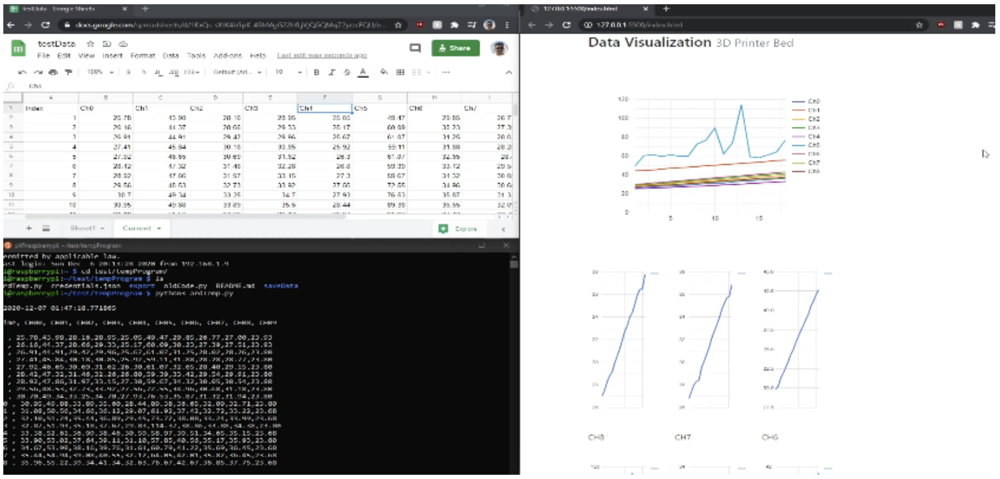

# Temperature Acquisition System (Fall 2020 ME450 Team 27 - Senior Design Project)
Team 27: Heated Bed Temperature Acquisition System Sensor Code

## File Hierarchy
```
.
├── Final/ 
│   ├── Arduino Code/
│   │   ├── Hello_MAX11131.cpp
│   │   ├── MAX11131.cpp
│   │   ├── MAX11131.h
│   │   ├── MAX11131_Hello.ino
│   │   ├── README.md
│   │   ├── mI_readme.adoc
│   │   └── sketch.json
│   ├── Raspberry Pi Code/
│   │   ├── gsheets/
│   │   │   ├── README.md
│   │   │   └── ardTemp.py 
│   │   ├── standard/
│   │   │   ├── saveData/
│   │   │   │   └── README.md
│   │   │   ├── README.md
│   │   │   └── oldCode.py
│   │   └── README.md
│   └── README.md
├── oldCode/
│   ├── spiFiles/
│   │   ├── spt.py
│   │   └── test.py
│   ├── README.md
│   ├── ardTemp.py
│   ├── tempSensor.py
│   └── test.py
├── README.md
└── data_processing.py
```

made using [tree.nathanfriend.io](https://tree.nathanfriend.io/?s=(%27options!(%27fancy9~fullPath!false~trailingSlash9~rootDot9)~G(%27G%27FinalOArduinoLHello_JJ4.h*4_Hello.ino*0*mI_readme.adoc*sketch.json8Raspberry%20PiLgsheets5N-B%20*standard5-saveData5-NN-Q6*08022QOspiFiles5spt6*K808B8tempSensor68K22022data_processing6%27)~version!%271%27)*8--%20%200README.md2%5Cn4MAX111315%2F*6.py7Code82-9!trueBardTemp6Gsource!J4.cpp*Ktest6L%2075N-0*O%2F8Qold7%01QONLKJGB98765420-*)

## Wiring Diagram


### Physical Wiring




### IT'S ALIVE (Physical Function Example)


## Printed Parts - Solution Results
The image below is an example of warpage we saw without our solution (left) and the same part (same gcode, material, and quadrant) with our solution of an enclosure and localized heating elements (right). 


## Data

### CSV  File


### Terminal Output


### Live Data



